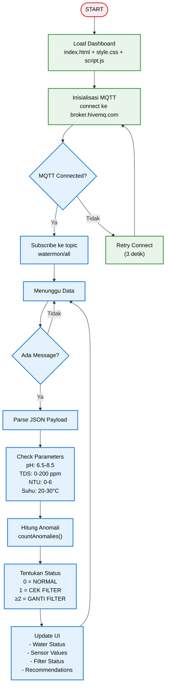
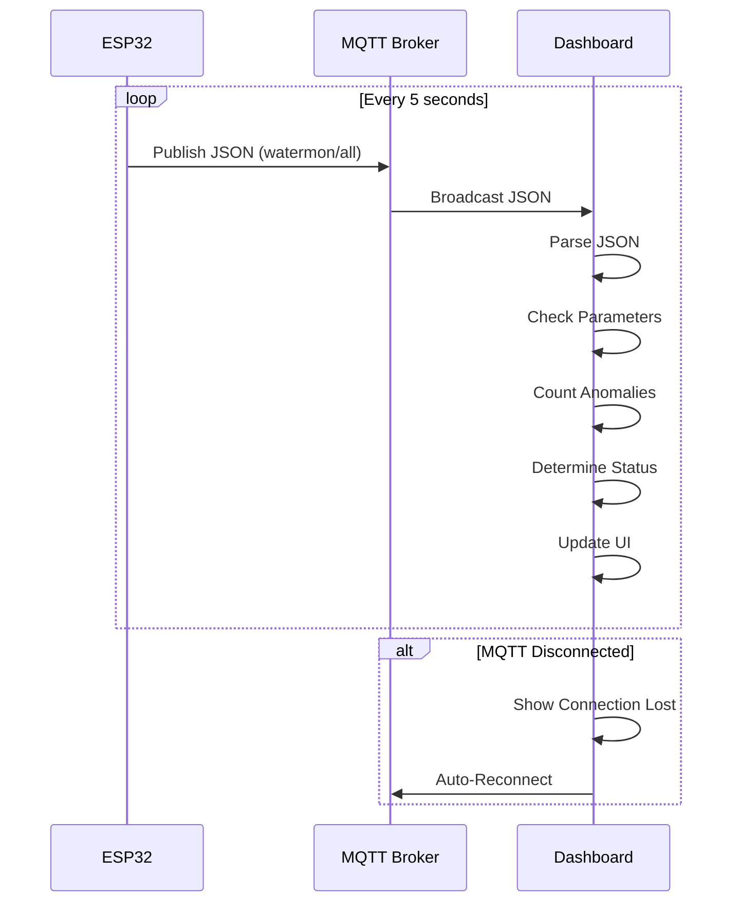

# 📄 README.md - DASHBOARD

<h1 align="center">💧 SMART RO WATER QUALITY MONITOR</h1>

<p align="center">
  
</p>

<p align="center">
  <em>Dashboard monitoring kualitas air RO real-time berbasis MQTT</em>
</p>

<p align="center">
  
  
  
  
  
  
  <a href="LICENSE">
    
  </a>
</p>

---

## 📑 Daftar Isi
- [✨ Overview](#-overview)
- [🌐 Live Demo](#-live-demo)
- [📊 Parameter RO yang Dimonitor](#-parameter-ro-yang-dimonitor)
- [🎯 Fitur Dashboard](#-fitur-dashboard)
- [🏗️ System Architecture](#%EF%B8%8F-system-architecture)
- [📊 Flowchart Dashboard](#-flowchart-dashboard)
- [📁 Project Structure](#-project-structure)
- [⚙️ Installation](#%EF%B8%8F-installation)
- [🚀 Usage](#-usage)
- [📦 Dependencies](#-dependencies)
- [🔧 Configuration](#-configuration)
- [🐞 Troubleshooting](#-troubleshooting)
- [📄 License](#-license)

---

## ✨ Overview

**Smart RO Water Quality Monitor Dashboard** adalah antarmuka web untuk memonitor kualitas air Reverse Osmosis secara real-time. Data diterima dari ESP32 melalui MQTT dan ditampilkan dalam dashboard modern dengan status filter yang jelas: **NORMAL / CEK FILTER / GANTI FILTER**.

### 🎯 Cara Kerja
1. **ESP32** membaca sensor dan mengirim data ke MQTT setiap 5 detik
2. **Dashboard** subscribe ke topic MQTT `watermon/all`
3. **Data** ditampilkan secara real-time dengan status otomatis
4. **Status Filter** ditentukan berdasarkan jumlah parameter anomali

---

## 🌐 Live Demo

👉 **[Buka Smart RO Console](https://wahyukurniaw4an.github.io/ro-monitoringg/)**

---

## 📊 Parameter RO yang Dimonitor

### Parameter Normal RO

| Parameter | Normal | Anomali | Sumber Data |
|-----------|--------|---------|-------------|
| **pH** | 6.5 - 8.5 | < 6.5 atau > 8.5 | `data.ph` |
| **TDS** | 0 - 200 ppm | > 200 ppm | `data.tds` |
| **Kekeruhan** | 0 - 6 NTU | > 6 NTU | `data.turbidity_ntu` |
| **Suhu** | 20 - 30 °C | < 20 atau > 30 | `data.temperature` |

### Status Filter

| Jumlah Anomali | Status | Warna | Emoji |
|----------------|--------|-------|-------|
| 0 | **NORMAL** | 🟢 Hijau | ✅ |
| 1 | **CEK FILTER** | 🟡 Kuning | ⚠️ |
| ≥ 2 | **GANTI FILTER** | 🔴 Merah | ❌ |

### Parameter Tambahan

| Parameter | Display | Sumber Data |
|-----------|---------|-------------|
| **Volume** | 0 - ∞ L | `data.volume` |
| **Flow Rate** | 0 - ∞ L/min | `data.flow_rate` |
| **Filter Health** | 0 - 100% | `data.health` |
| **Days Left** | 0 - ∞ | `data.days_left` |
| **Filter Score** | 0 - 100 | `data.filter_score` |

---

## 🎯 Fitur Dashboard

### ✅ Real-time Monitoring
- Data update setiap 5 detik via MQTT
- Status koneksi MQTT real-time
- Indikator ESP32 online/offline

### ✅ Water Quality Status
- Status **NORMAL / CEK FILTER / GANTI FILTER**
- Ikon visual (✅ / ⚠️ / ❌)
- Penjelasan detail status

### ✅ Parameter Sensor
- pH dengan range normal 6.5 - 8.5
- TDS dengan range normal 0 - 200 ppm
- Kekeruhan dengan range normal 0 - 6 NTU
- Suhu dengan range normal 20 - 30 °C

### ✅ Filter Health Monitor
- Estimasi umur filter (0-100%)
- Progress bar dengan warna indikator
- Estimasi hari tersisa

### ✅ Filter Replacement Logic
- Status filter berdasarkan jumlah parameter anomali
- Skor filter (0-100)
- Daftar parameter anomali
- Rekomendasi tindakan

### ✅ Responsive Design
- Mobile & Desktop friendly
- Light theme dengan efek glassmorphism
- Grid layout adaptif

---

## 🏗️ System Architecture

```text
┌────────────────────────────────────────────────────────────────┐
│                      GITHUB PAGES                              │
│                 (https://user.github.io/ro)                    │
│  ┌─────────────────────────────────────────────────────────┐   │
│  │                    WEB DASHBOARD                        │   │
│  │  ┌───────────────┐  ┌───────────────┐  ┌────────────┐   │   │
│  │  │  Water Status │  │ Filter Health │  │  Parameter │   │   │
│  │  └───────────────┘  └───────────────┘  └────────────┘   │   │
│  │  ┌───────────────┐  ┌───────────────┐  ┌────────────┐   │   │
│  │  │  pH / TDS     │  │ Turbidity/Temp│  │  Volume    │   │   │
│  │  └───────────────┘  └───────────────┘  └────────────┘   │   │
│  └─────────────────────────────────────────────────────────┘   │
└────────────────────────────────────────────────────────────────┘
                                    │
                                    │ MQTT over WebSocket (WSS)
                                    ▼
┌─────────────────────────────────────────────────────────────────┐
│                      MQTT BROKER (HiveMQ)                       │
│                    broker.hivemq.com:8884                       │
│                   Topic: watermon/all                           │
└─────────────────────────────────────────────────────────────────┘
                                    │
                                    │ MQTT over TCP
                                    ▼
┌─────────────────────────────────────────────────────────────────┐
│                             ESP32                               │
│   ┌─────────────────────────────────────────────────────────┐   │
│   │                     SENSORS                             │   │
│   │  pH, TDS, Turbidity, Temperature, Flow                  │   │
│   └─────────────────────────────────────────────────────────┘   │
└─────────────────────────────────────────────────────────────────┘
```

---

## 📊 Flowchart Dashboard

### Flowchart Utama Dashboard


### Flowchart Data Flow


---

## 📁 Project Structure

```text
smart-ro-monitor/
├── 📄 index.html                 # Main Dashboard
├── 📜 script.js                  # MQTT + Logic
├── 🎨 style.css                  # Styling & Responsive
├── 📄 README.md                  # Dokumentasi Dashboard
├── 📁 assets/                    # Gambar & screenshot
└── 📁 esp32/                     # ESP32 Firmware
    ├── 📄 smart_ro_monitor.ino
    └── 📄 water_rules.h
```

---

## ⚙️ Installation

### 1. Clone Repository
```bash
git clone https://github.com/username/smart-ro-monitor.git
cd smart-ro-monitor
```

### 2. Deploy ke GitHub Pages

**Option A: Auto Deploy**
1. Upload semua file ke repository GitHub
2. Buka **Settings** → **Pages**
3. Pilih **Source**: `Deploy from a branch` → `main` → `/ (root)`
4. Simpan
5. Tunggu 1-2 menit
6. Akses: `https://username.github.io/smart-ro-monitor`

**Option B: Local Development**
```bash
# Python
python -m http.server 8080

# Node.js
npx http-server . -p 8080
```

### 3. ESP32 Setup
1. Upload `esp32/smart_ro_monitor.ino` ke ESP32
2. Setup WiFi melalui hotspot `WaterMonitor`
3. ESP32 akan otomatis publish data ke MQTT

---

## 🚀 Usage

### Dashboard
1. **Buka Dashboard** di browser
2. **Tunggu koneksi MQTT** (< 10 detik)
3. **Data akan muncul** secara real-time

### Connection Status
| Status | Warna | Arti |
|--------|-------|------|
| Terhubung | 🟢 | MQTT Terhubung |
| Terputus | 🔴 | MQTT Terputus |
| Menghubungkan... | 🟡 | MQTT Connecting |

### Interpretasi Status
| Status | Arti | Tindakan |
|--------|------|----------|
| ✅ NORMAL | Semua parameter normal | Lanjutkan pemantauan |
| 🟡 CEK FILTER | 1 parameter anomali | Periksa filter & sensor |
| 🔴 GANTI FILTER | ≥ 2 parameter anomali | Segera ganti filter |

---

## 📦 Dependencies

### Frontend (CDN)
| Library | Version | Purpose |
|---------|---------|---------|
| [Chart.js](https://www.chartjs.org/) | 3.9.1 | Grafik real-time (optional) |
| [MQTT.js](https://github.com/mqttjs/MQTT.js) | 4.3.7 | MQTT over WebSocket |
| [Google Fonts](https://fonts.google.com/) | - | Outfit & JetBrains Mono |

### ESP32 (Arduino)
| Library | Purpose |
|---------|---------|
| `WiFiManager` | WiFi setup via captive portal |
| `PubSubClient` | MQTT communication |
| `LiquidCrystal_I2C` | LCD 20x4 display |
| `DallasTemperature` | DS18B20 temperature sensor |
| `OneWire` | 1-Wire communication |

---

## 🔧 Configuration

### MQTT Configuration
```javascript
// script.js
const MQTT_BROKER = "wss://broker.hivemq.com:8884/mqtt";
const MQTT_TOPIC = "watermon/all";
```

### Parameter RO
```javascript
// script.js
const PARAM_RO = {
    phMin: 6.5,
    phMax: 8.5,
    tdsMax: 200,
    ntuMax: 6,
    tempMin: 20,
    tempMax: 30
};
```

### ESP32 Configuration
```cpp
// smart_ro_monitor.ino
#define MQTT_BROKER "broker.hivemq.com"
#define MQTT_PORT 1883
#define MQTT_CLIENT_ID "esp32-ro-monitor-001"
#define MQTT_TOPIC_ALL "watermon/all"
```

---

## 🐞 Troubleshooting

### Dashboard Tidak Connect
| Masalah | Solusi |
|---------|--------|
| MQTT offline | Cek koneksi internet |
| ESP32 tidak publish | Cek power & WiFi ESP32 |
| WebSocket error | Refresh halaman / clear cache |
| Tracking Prevention | Gunakan browser lain / nonaktifkan |

### Data Tidak Muncul
| Masalah | Solusi |
|---------|--------|
| JSON parse error | Buka Console Browser (F12) |
| Topic salah | Cek `watermon/all` |
| ESP32 offline | Periksa Serial Monitor |
| Payload terlalu besar | Update ESP32 dengan minimal payload |

### Status Filter Salah
| Masalah | Solusi |
|---------|--------|
| Parameter RO salah | Cek range parameter di script.js |
| Anomali tidak terdeteksi | Cek nilai parameter yang diterima |
| Status tidak update | Refresh dashboard |

### Debug Mode
```javascript
// Buka Console Browser (F12)
// Cek state
console.log(debug.state);

// Cek data terakhir
console.log(debug.state.lastData);

// Cek parameter
console.log(debug.state.ph, debug.state.tds);
```

---

## 📄 License

MIT License © 2026

---

<div align="center">

**💧 Smart RO Water Quality Monitoring System**  
**Built with ESP32 • MQTT • GitHub Pages**

⭐ **Star this repo if you like it!**

<p><a href="#top">⬆ Kembali ke Atas</a></p>

</div>
