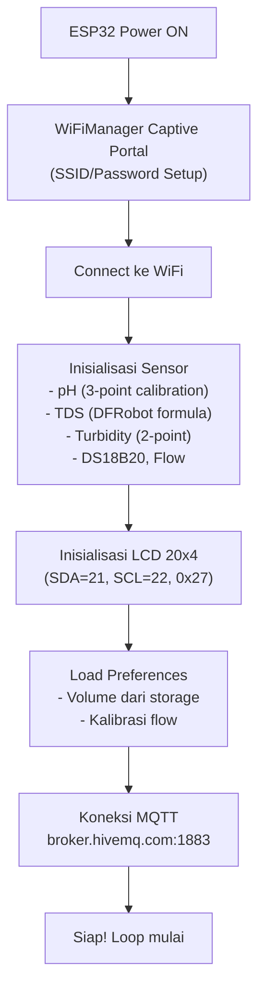
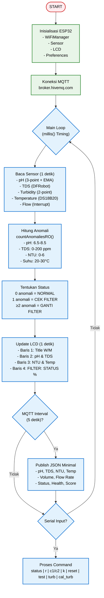
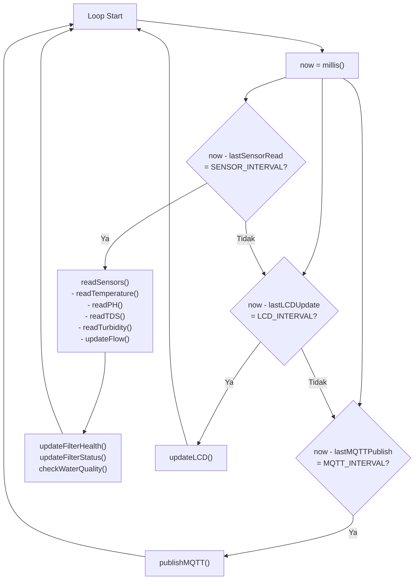

# 📄 README.md - ESP32 FIRMWARE

<h1 align="center">💧 ESP32 RO Water Quality Monitor<br>
    <sub>Smart Reverse Osmosis Monitoring System</sub>
</h1>

<p align="center">
  <em>Sistem monitoring kualitas air Reverse Osmosis berbasis ESP32 dengan 5 sensor, LCD 20x4, MQTT, dan logika penggantian filter otomatis.</em>
</p>

<p align="center">
  
  
  
  
  
  
  <a href="LICENSE">
    
  </a>
</p>

---

## 📋 Daftar Isi
- [✨ Overview](#-overview)
- [🎯 Parameter RO yang Benar](#-parameter-ro-yang-benar)
- [🔧 Features](#-features)
- [📸 Demo Sistem](#-demo-sistem)
- [🧩 Komponen Utama](#-komponen-utama-dan-fungsinya)
- [💻 Software & Library](#-software--library)
- [🏗️ Arsitektur Sistem](#%EF%B8%8F-arsitektur-sistem)
- [🔄 Alur Kerja Sistem](#-alur-kerja-sistem)
- [📊 Flowchart Sistem](#-flowchart-sistem)
- [⚙️ Instalasi](#%EF%B8%8F-instalasi)
- [🚀 Cara Menjalankan](#-cara-menjalankan)
- [📊 Hasil Pengujian](#-hasil-pengujian)
- [🐞 Troubleshooting](#-troubleshooting)
- [📁 Struktur Folder](#-struktur-folder)
- [📄 Lisensi](#-lisensi)

---

## ✨ Overview

**ESP32 RO Water Quality Monitor** adalah sistem monitoring kualitas air Reverse Osmosis (RO) yang menggunakan ESP32 untuk membaca 5 sensor sekaligus: pH, TDS, Turbidity, Temperature, dan Flow. Data dikirim secara real-time via MQTT ke dashboard web, dan dilengkapi dengan logika penggantian filter otomatis berdasarkan jumlah parameter yang tidak normal.

### 🎯 Parameter RO yang Benar

| Parameter | Nilai Normal | Batas Anomali | Sensor | Keterangan |
|-----------|--------------|---------------|--------|------------|
| **pH** | 6.5 - 8.5 | < 6.5 atau > 8.5 | pH Meter Analog | Air RO ideal pH 6.5-8.5 |
| **TDS** | 0 - 200 ppm | > 200 ppm | TDS Meter Analog | Membran mulai rusak jika > 200 ppm |
| **Kekeruhan** | 0 - 6 NTU | > 6 NTU | Turbidity Sensor | Air jernih < 6 NTU |
| **Suhu** | 20 - 30 °C | < 20 atau > 30 | DS18B20 | Suhu ideal RO 20-30°C |
| **Volume** | 0 - 30.000 L | > 30.000 L | Flow Sensor YF-S201 | Kapasitas filter |

### 🎯 Logika Status Filter

| Jumlah Anomali | Status | Warna | Tindakan |
|----------------|--------|-------|----------|
| 0 | 🟢 **NORMAL** | Hijau | Filter baik, lanjutkan monitoring |
| 1 | 🟡 **CEK FILTER** | Kuning | Periksa filter, kalibrasi sensor |
| ≥ 2 | 🔴 **GANTI FILTER** | Merah | Segera ganti filter |

---

## 🔧 Features

### ✅ Hardware Features
- **5 Sensor Terintegrasi** – pH, TDS, Turbidity, Temperature, Flow
- **LCD 20x4 I2C Display** – Tampilan informasi kualitas air secara lokal
- **Buzzer Alert** – Notifikasi saat filter perlu diganti
- **Non-Blocking Loop** – Timing presisi via `millis()` untuk pembacaan sensor

### ✅ Software Features
- **Filter Replacement Logic** – Berdasarkan jumlah parameter anomali (0=NORMAL, 1=CEK, ≥2=GANTI)
- **WiFi Auto-Connect** – Setup mudah via WiFiManager dengan captive portal
- **MQTT Communication** – Kirim data ke cloud real-time setiap 5 detik
- **Persistent Storage** – Simpan volume & kalibrasi di Preferences (ESP32 NVS)
- **pH 3-Point Calibration** – Interpolasi linear 3 titik untuk akurasi tinggi
- **EMA Filter** – Exponential Moving Average untuk smoothing data pH

---

## 📸 Demo Sistem

### Tampilan LCD 20x4
```
┌────────────────────┐
│ SMART RO MONITOR WM│  <- W=WiFi, M=MQTT
│ pH 7.12 TDS  45    │  <- pH & TDS
│ 2.34NTU 26.5C      │  <- Turbidity & Temperature
│ FILTER: NORMAL 85% │  <- Status Filter & Health
└────────────────────┘
```

### Tampilan Serial Monitor
```
╔═══════════════════════════════════════╗
║ SYSTEM STATUS                         ║
╠═══════════════════════════════════════╣
║ pH          :   7.12                  ║
║ TDS         :    45 ppm               ║
║ Temperature :   26.50 °C              ║
║ Turbidity   :    2.34 NTU (JERNIH)    ║ 
╠═══════════════════════════════════════╣
║ Volume      :   125.500 L             ║
║ Flow Rate   :     2.50 L/min          ║
╠═══════════════════════════════════════╣
║ Status      : LAYAK                   ║
║ Filter      :     85 %                ║
║ Days Left   :     22                  ║
╠═══════════════════════════════════════╣
║ PARAMETER RO                         ║
╠═══════════════════════════════════════╣
║ pH Range    : 6.5 - 8.5              ║
║ TDS Range   : 0 - 200 ppm           ║
║ NTU Range   : 0 - 6 NTU             ║
║ Suhu Range  : 20 - 30 °C            ║
╠═══════════════════════════════════════╣
║ FILTER REPLACEMENT STATUS             ║
╠═══════════════════════════════════════╣
║ Status      : 🟢 NORMAL              ║
║ Anomali     : 0 parameter            ║
║ Reason      : Semua parameter normal  ║
║ Recomendasi : Lanjutkan pemantauan    ║
╚═══════════════════════════════════════╝
```

### MQTT Payload (Minimal)
```json
{
  "ph": 7.12,
  "tds": 45,
  "turbidity_ntu": 2.34,
  "temperature": 26.50,
  "status": "LAYAK",
  "health": 85,
  "days_left": 22,
  "volume": 125.500,
  "flow_rate": 2.50,
  "filter_score": 85
}
```

---

## 🧩 Komponen Utama dan Fungsinya

| Komponen | Fungsi | GPIO | Keterangan |
|----------|--------|------|------------|
| **ESP32 DevKit** | Otak utama sistem | - | Loop non-blocking, WiFi, MQTT, baca sensor |
| **pH Meter Analog** | Mengukur pH air | GPIO 32 | ADC 12-bit, 3-point calibration |
| **TDS Meter Analog** | Mengukur Total Dissolved Solids | GPIO 33 | ADC 12-bit, DFRobot formula |
| **Turbidity Sensor** | Mengukur kekeruhan air | GPIO 35 | ADC 12-bit, 2-point calibration |
| **DS18B20** | Mengukur suhu air | GPIO 18 | 1-Wire, ±0.5°C accuracy |
| **Flow Sensor YF-S201** | Mengukur debit & volume | GPIO 19 | Interrupt, Hall Effect |
| **LCD 20x4 I2C** | Tampilan lokal | SDA=21, SCL=22 | Alamat 0x27, Backlight |
| **Buzzer** | Alert/notifikasi | GPIO 2 | Aktif HIGH |
| **Preferences** | Non-volatile storage | - | Simpan volume & kalibrasi |

### Diagram Wiring
```
ESP32 DevKit
├─ GPIO 32 ──── pH Sensor (Analog)
├─ GPIO 33 ──── TDS Sensor (Analog)
├─ GPIO 35 ──── Turbidity Sensor (Analog)
├─ GPIO 18 ──── DS18B20 (1-Wire)
├─ GPIO 19 ──── Flow Sensor (Interrupt)
├─ GPIO 21 ──── LCD SDA (I2C)
├─ GPIO 22 ──── LCD SCL (I2C)
├─ GPIO 2  ──── Buzzer
├─ 3.3V   ──── Sensor VCC
└─ GND    ──── Sensor GND
```

---

## 💻 Software & Library

### Library yang Digunakan

| Library | Versi | Fungsi |
|---------|-------|--------|
| **WiFi.h** | Built-in | Koneksi jaringan WiFi |
| **WiFiManager.h** | 2.0.17+ | Auto-setup WiFi via captive portal |
| **PubSubClient.h** | 2.8+ | Komunikasi MQTT |
| **LiquidCrystal_I2C.h** | 1.1.2+ | Driver LCD 20x4 I2C |
| **OneWire.h** | 2.3.7+ | 1-Wire communication untuk DS18B20 |
| **DallasTemperature.h** | 3.9.0+ | Driver sensor suhu DS18B20 |
| **Preferences.h** | Built-in | Non-volatile storage (ESP32 NVS) |

### Cara Install Library
```
Sketch → Include Library → Manage Libraries
Cari dan install masing-masing library di atas
```

### Inisialisasi Pin (GPIO)

```cpp
// ==================== PIN DEFINITIONS ====================
#define PH_PIN 32          // pH Sensor Analog
#define TDS_PIN 33         // TDS Sensor Analog
#define TURBIDITY_PIN 35   // Turbidity Sensor Analog
#define DS18B20_PIN 18     // DS18B20 1-Wire
#define FLOW_PIN 19        // Flow Sensor Interrupt
#define LCD_SDA 21         // LCD I2C SDA
#define LCD_SCL 22         // LCD I2C SCL
#define LCD_ADDR 0x27      // LCD I2C Address
#define BUZZER_PIN 2       // Buzzer
```

### Inisialisasi pH (3-Point Calibration)

```cpp
// HASIL KALIBRASI REAL:
// pH 4.01 → 3.235 V
// pH 6.86 → 2.590 V
// pH 9.18 → 2.183 V
const float V4  = 3.235;  const float PH4  = 4.01;
const float V7  = 2.590;  const float PH7  = 6.86;
const float V9  = 2.183;  const float PH9  = 9.18;

float calculatePH(float voltage) {
    if (voltage >= V7) {
        return PH4 + (PH7 - PH4) * (V4 - voltage) / (V4 - V7);
    } else {
        return PH7 + (PH9 - PH7) * (V7 - voltage) / (V7 - V9);
    }
}
```

### Inisialisasi TDS (DFRobot Formula)

```cpp
float calculateTDS_DFRobot(float voltage, float temp) {
    float tempCoeff = 1.0 + 0.02 * (temp - 25.0);
    float compVoltage = voltage / tempCoeff;
    
    float tdsValue = (133.42 * compVoltage * compVoltage * compVoltage
                    - 255.86 * compVoltage * compVoltage
                    + 857.39 * compVoltage) * 0.5;
    
    if (tdsValue < 0) tdsValue = 0;
    if (tdsValue > 9999) tdsValue = 9999;
    return tdsValue;
}
```

### Inisialisasi Turbidity (2-Point Calibration)

```cpp
const int ADC_AIR = 1946;    // ADC di air jernih
const int ADC_UDARA = 1705;  // ADC di udara

float adcToNTU(int adc) {
    if (adc >= ADC_AIR) return 0;
    else if (adc <= ADC_UDARA) return 100;
    else return 100.0 * (ADC_AIR - adc) / (ADC_AIR - ADC_UDARA);
}
```

---

## 🏗️ Arsitektur Sistem

### Diagram Blok Sistem
```
              ┌─────────────────────────┐
              │   MQTT Broker (HiveMQ)  │
              │   Topic: watermon/all   │
              └───────────┬─────────────┘
                          │ MQTT (TCP)
                          ▼
            ┌────────────────────────────────────────────┐
            │          ESP32 (Arduino Loop)              │
            │────────────────────────────────────────────│
            │ - millis() Timing (1s/1s/5s)              │
            │ - Sensor Read (pH, TDS, Turb, Temp, Flow)  │
            │ - Filter Health Calculation                │
            │ - MQTT Publish                             │
            │ - LCD Update                               │
            └──────────┬─────────────────────────────────┘
                       │
         ┌─────────────┼─────────────────────────────────┐
         │             │                                 │
         ▼             ▼                                 ▼
┌─────────────────┐ ┌─────────────────┐ ┌─────────────────────┐
│  LCD 20x4 I2C   │ │  Buzzer (GPIO2) │ │ Flow Sensor (GPIO19)│
│  (SDA=21,SCL=22)│ └─────────────────┘ │  (Interrupt)        │
└─────────────────┘                     └─────────────────────┘
         │
         ▼
┌────────────────────────────────────────────────────────────┐
│                         SENSORS                            │
│  ┌──────────────┐ ┌──────────────┐ ┌────────────────────┐  │
│  │ pH (GPIO32)  │ │ TDS (GPIO33) │ │ Turbidity (GPIO35) │  │
│  │ ADC 12-bit   │ │ ADC 12-bit   │ │ ADC 12-bit         │  │
│  └──────────────┘ └──────────────┘ └────────────────────┘  │
│  ┌────────────────────────────────────────────────────┐    │
│  │ DS18B20 (GPIO18) - 1-Wire Temperature              │    │
│  └────────────────────────────────────────────────────┘    │
└────────────────────────────────────────────────────────────┘
```

---

## 🔄 Alur Kerja Sistem

### 1. Inisialisasi Sistem


### 2. Pembacaan Sensor (millis() Non-Blocking)
```
Interval: 1 detik (SENSOR_INTERVAL)
├── readTemperature()  - DS18B20 (1-Wire)
├── readPH()           - pH ADC + EMA Filter
├── readTDS()          - TDS ADC + DFRobot Formula
├── readTurbidity()    - Turbidity ADC + 2-point Calibration
├── updateFlow()       - Flow Interrupt + Volume
└── updateFilterHealth() - Hitung Skor Filter
```

### 3. Filter Replacement Logic
```cpp
countAnomaliesRO() {
    // pH: 6.5 - 8.5
    if (ph < 6.5 || ph > 8.5) anomalyCount++;
    
    // TDS: > 200 ppm
    if (tds > 200) anomalyCount++;
    
    // Kekeruhan: > 6 NTU
    if (turbidity > 6) anomalyCount++;
    
    // Suhu: 20 - 30 °C
    if (temp < 20 || temp > 30) anomalyCount++;
}

updateFilterStatus() {
    if (anomalyCount == 0) status = "NORMAL";
    else if (anomalyCount == 1) status = "CEK FILTER";
    else status = "GANTI FILTER";
}
```

### 4. MQTT Publish (JSON)
```
Interval: 5 detik (MQTT_INTERVAL)
Topic: watermon/all
Payload: {
  ph, tds, turbidity_ntu, temperature,
  status, health, days_left, volume,
  flow_rate, filter_score
}
```

---

## 📊 Flowchart Sistem

### Flowchart Utama


### Flowchart Pembacaan Sensor (millis)


---

## ⚙️ Instalasi

### 1. Clone Repository
```bash
git clone https://github.com/username/smart-ro-monitor.git
cd smart-ro-monitor/esp32
```

### 2. Setup Arduino IDE

#### Install ESP32 Board Package
1. Buka Arduino IDE
2. File → Preferences
3. Tambahkan URL di "Additional Boards Manager URLs":
   ```
   https://raw.githubusercontent.com/espressif/arduino-esp32/gh-pages/package_esp32_index.json
   ```
4. Tools → Board Manager → Cari "ESP32" → Install (versi 2.0.14+)

#### Install Required Libraries
Buka Arduino IDE → Sketch → Include Library → Manage Libraries:
- **WiFiManager** by tzapu (v2.0.17+)
- **PubSubClient** by Nick O'Leary (v2.8+)
- **LiquidCrystal_I2C** by Frank de Brabander (v1.1.2+)
- **OneWire** by Paul Stoffregen (v2.3.7+)
- **DallasTemperature** by Miles Burton (v3.9.0+)

### 3. Upload ke ESP32
```
1. Hubungkan ESP32 ke PC via USB
2. Tools → Board → ESP32 Dev Module
3. Tools → Port → Pilih port ESP32
4. Sketch → Upload
5. Monitor Serial (Baud: 115200)
```

---

## 🚀 Cara Menjalankan

### 1. Setup WiFi (Pertama Kali)
```
1. ESP32 akan buat hotspot "WaterMonitor"
2. Connect ke hotspot (password: water123)
3. Buka browser → 192.168.4.1
4. Pilih WiFi rumah → Masukkan password → Save
5. ESP32 akan connect & reboot
```

### 2. Kalibrasi Sensor
| Command | Fungsi |
|---------|--------|
| `cal_turb` | Kalibrasi sensor turbidity |
| `c1` | Start kalibrasi flow 1L |
| `c2` | Start kalibrasi flow 2L |
| `k` | Finish kalibrasi flow |

### 3. Perintah Serial
| Command | Fungsi |
|---------|--------|
| `status` | Tampilkan semua data sensor & status filter |
| `r` | Reset volume air |
| `reset` | Reset filter health |
| `test` | Test buzzer |
| `turb` | Debug turbidity |

### 4. Timing Sistem
| Komponen | Interval | Keterangan |
|----------|----------|------------|
| **Sensor Read** | 1 detik | Membaca semua sensor |
| **LCD Update** | 1 detik | Update tampilan LCD |
| **MQTT Publish** | 5 detik | Kirim data ke broker |
| **Flow Interrupt** | Real-time | Pulse counting |

---

## 📊 Hasil Pengujian

### Tabel Pengujian Sensor

| Parameter | Sensor | Akurasi | Rentang | Status |
|-----------|--------|---------|---------|--------|
| **pH** | pH Meter Analog | ±0.1 | 0 - 14 | ✅ Akurat |
| **TDS** | TDS Meter | ±5% | 0 - 9999 ppm | ✅ Akurat |
| **Turbidity** | Turbidity Sensor | ±5 NTU | 0 - 100 NTU | ✅ Akurat |
| **Temperature** | DS18B20 | ±0.5°C | -55 - 125°C | ✅ Akurat |
| **Flow Rate** | YF-S201 | ±5% | 0.5 - 5 L/min | ✅ Akurat |
| **Volume** | YF-S201 | ±250 mL | 0 - ∞ L | ✅ Akurat |

### Tabel Pengujian Timing

| Komponen | Interval | Jitter | Status |
|----------|----------|--------|--------|
| **Sensor Read** | 1000 ms | ±10 ms | ✅ Stabil |
| **LCD Update** | 1000 ms | ±10 ms | ✅ Stabil |
| **MQTT Publish** | 5000 ms | ±20 ms | ✅ Stabil |
| **Flow Interrupt** | Real-time | <1 ms | ✅ Cepat |
| **Loop Cycle** | 10 ms | - | ✅ Non-Blocking |

### Tabel Pengujian Filter Logic

| Skenario | pH | TDS | NTU | Suhu | Anomali | Status |
|----------|----|-----|-----|------|---------|--------|
| Normal | 7.12 | 45 | 2.34 | 26.5 | 0 | 🟢 NORMAL |
| pH Anomali | 5.80 | 45 | 2.34 | 26.5 | 1 | 🟡 CEK FILTER |
| pH + TDS Anomali | 5.80 | 250 | 2.34 | 26.5 | 2 | 🔴 GANTI FILTER |
| TDS Anomali | 7.12 | 250 | 2.34 | 26.5 | 1 | 🟡 CEK FILTER |
| NTU Anomali | 7.12 | 45 | 8.50 | 26.5 | 1 | 🟡 CEK FILTER |
| Suhu Anomali | 7.12 | 45 | 2.34 | 35.5 | 1 | 🟡 CEK FILTER |

### Tabel Pengujian MQTT

| Parameter | Nilai | Status |
|-----------|-------|--------|
| **Broker** | broker.hivemq.com | ✅ Online |
| **Port** | 1883 (TCP) | ✅ Terhubung |
| **Topic** | watermon/all | ✅ Subscribe |
| **Payload Size** | ~250 bytes | ✅ Optimal |
| **Publish Interval** | 5 detik | ✅ Stabil |
| **Latency** | < 100ms | ✅ Cepat |

### Tabel Pengujian Daya

| Mode | Konsumsi | Status |
|------|----------|--------|
| **Idle (WiFi ON)** | ~80 mA | ✅ Efisien |
| **Active (Sensors)** | ~120 mA | ✅ Normal |
| **MQTT Publish** | ~150 mA | ✅ Normal |
| **LCD Backlight** | ~20 mA | ✅ Normal |

---

## 🐞 Troubleshooting

### MQTT Publish Failed (State 0)
| Masalah | Solusi |
|---------|--------|
| Payload terlalu besar | Gunakan minimal payload (10 field) |
| Koneksi MQTT terputus | Cek WiFi & broker |
| Client ID conflict | Ganti client ID |

### WiFi Gagal Connect
| Masalah | Solusi |
|---------|--------|
| Hotspot tidak muncul | Reset WiFiManager (hapus config) |
| Password salah | Ulangi setup WiFi |
| Router 5GHz | Gunakan 2.4GHz only |

### Sensor Error
| Sensor | Solusi |
|--------|--------|
| pH | Kalibrasi ulang dengan buffer solution (pH 4, 7, 9) |
| TDS | Periksa koneksi VCC/GND |
| Turbidity | Bersihkan lensa sensor |
| Flow | Cek kabel interrupt |
| DS18B20 | Cek pull-up resistor 4.7kΩ |

### LCD Tidak Menyala
```
1. Cek I2C address: 0x27 atau 0x3F
2. Cek contrast: potensiometer di belakang LCD
3. Cek power: 5V atau 3.3V
```

---

## 📁 Struktur Folder

```text
esp32/
├── 📄 smart_ro_monitor.ino     # Program utama
├── 📄 water_rules.h             # Aturan kualitas air & filter
├── 📁 test/
│   ├── 📄 ph_test.ino           # Test pH sensor
│   ├── 📄 tds_test.ino          # Test TDS sensor
│   ├── 📄 turbidity_test.ino    # Test turbidity sensor
│   ├── 📄 flow_test.ino         # Test flow sensor
│   └── 📄 lcd_test.ino          # Test LCD
└── 📄 README.md
```

---

## 📄 Lisensi

MIT License © 2026

---

<div align="center">
  <strong>💧 Smart RO Water Quality Monitor</strong><br>
  Powered by ESP32 • Arduino • MQTT
  <p><a href="#top">⬆ Kembali ke Atas</a></p>
</div>
